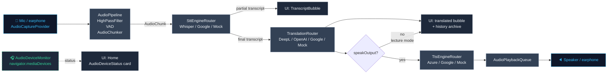
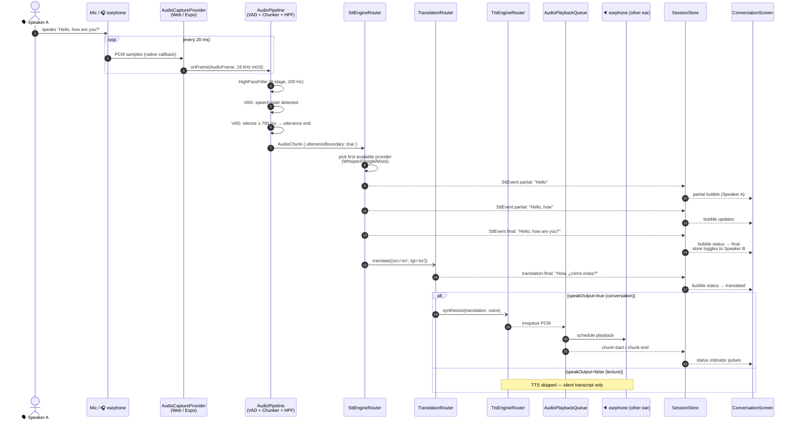
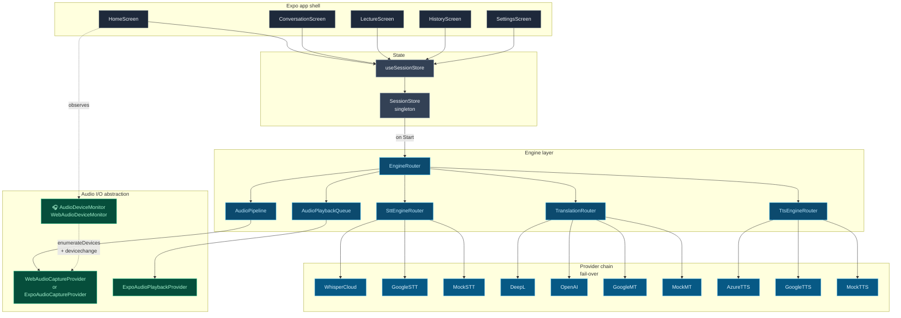
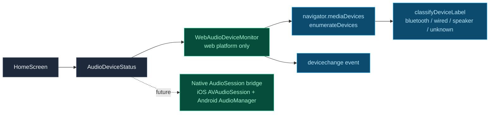

# Smart Translator — End-to-end Flow Diagram

> Audio in → STT → MT → TTS → Audio out, as wired in code today.

This document is a one-page architectural reference for how a single
spoken utterance moves through the app. All diagrams are Mermaid (GitHub
renders them natively).

## 1. High-level pipeline



## 2. Conversation-mode sequence (one utterance)



## 3. Component map (state + ownership)



## 4. Code path (file references)

| Stage | File | Key symbol |
|-------|------|------------|
| User taps **Start Translation** | `src/screens/ConversationScreen.tsx` | `sessionStore.startSession()` |
| Build router from env + selected engines | `src/core/engine-factory.ts` | `createEngineRouter` |
| Orchestrate the full pipeline | `src/core/engine-router.ts` | `EngineRouter.start` / `handleSttEvent` / `translateAndSpeak` |
| Capture mic audio | `src/core/audio/web-audio-capture.ts` (web) <br/>`src/core/audio/expo-audio-capture.ts` (native) | `WebAudioCaptureProvider` |
| Detect connected audio device | `src/core/audio/web-audio-device-monitor.ts` | `WebAudioDeviceMonitor` |
| Voice-activity + chunking + noise reduction | `src/core/audio/audio-pipeline.ts` <br/>`src/core/audio/vad.ts` <br/>`src/core/audio/audio-chunker.ts` <br/>`src/core/audio/noise-reduction.ts` | `AudioPipeline`, `VoiceActivityDetector`, `AudioChunker`, `HighPassFilter` |
| STT provider chain | `src/core/stt/stt-engine-router.ts` | `SttEngineRouter` |
| Translation provider chain | `src/core/translation/translation-router.ts` | `TranslationRouter` |
| TTS provider chain | `src/core/tts/tts-engine-router.ts` | `TtsEngineRouter` |
| Playback queue (low-latency) | `src/core/audio/audio-playback.ts` | `AudioPlaybackQueue` |
| Aggregate state for the UI | `src/state/SessionStore.ts` | `SessionStore` |
| Render transcripts + waveform | `src/screens/ConversationScreen.tsx` <br/>`src/components/TranscriptBubble.tsx` <br/>`src/components/WaveformIndicator.tsx` | — |

## 5. Data shapes (cheat sheet)

```ts
// src/core/audio/audio-types.ts
SAMPLE_RATE_HZ = 16_000
FRAME_DURATION_MS = 20
FRAME_SAMPLES = 320          // = 16_000 × 20 / 1_000

interface AudioFrame  { samples: Int16Array; seq: number; startTimestampMs; durationMs }
interface AudioChunk  { samples: Int16Array; startTimestampMs; durationMs;
                        utteranceBoundary?: boolean; final?: boolean }
type SttEvent         = { type: 'partial' | 'final'; sessionId; text; detectedLang? }
type TranslationResult = { text; sourceLang; targetLang; provider; latencyMs }
```

## 6. Where the AudioDeviceMonitor sits

The new `AudioDeviceMonitor` is a **status-only side channel** — it does
not feed audio into the pipeline. It exists so the Home screen can show
the user *which earphone is connected before they hit Start*.


